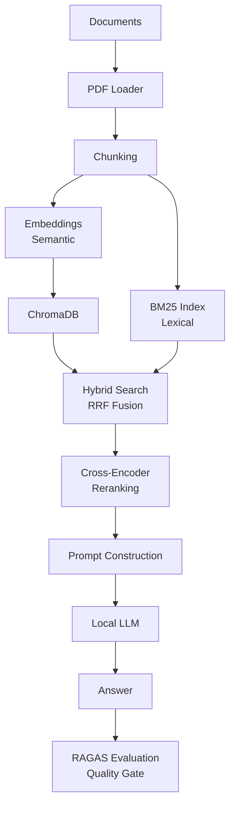
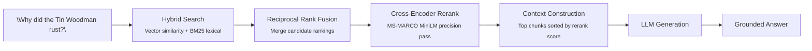

# 🚀 RAGGED


> A privacy-first, fully local Retrieval-Augmented Generation (RAG) system built from scratch in Python.

RAGGED transforms your documents into a searchable knowledge base and allows Large Language Models (LLMs) to answer questions grounded in your own data — hybrid retrieval, cross-encoder reranking, and RAGAS-based quality gates included.

Everything runs locally on your machine. No OpenAI required. No cloud dependency. No vendor lock-in.

---

## Table of Contents

* [Why RAG?](#why-rag)
* [How RAGGED Works](#how-ragged-works)
* [Features](#features)
* [Installation](#installation)
* [Configuration](#configuration)
* [Quick Start](#quick-start)
* [Evaluation](#evaluation)
* [Project Status](#project-status)
* [Tech Stack](#tech-stack)
* [Author](#author)

---

## Why RAG?

Large Language Models are powerful, but they have two major limitations:

* They cannot access your private documents.
* They can generate incorrect or hallucinated answers.

Retrieval-Augmented Generation solves this by introducing a retrieval layer. When a user asks a question:

1. Relevant document chunks are retrieved.
2. Retrieved context is added to the prompt.
3. The LLM generates an answer grounded in those documents.

This allows the model to answer questions about information it was never trained on.

---

## How RAGGED Works



A query flows through hybrid search, fusion, reranking, and generation:



---

## Features

| Area | Capability |
| --- | --- |
| **Ingestion** | PDF loading via PyMuPDF, multi-document knowledge bases, automatic metadata & source tracking |
| **Chunking** | Recursive character splitting, configurable size/overlap, context preservation |
| **Embeddings** | `BAAI/bge-base-en-v1.5`, GPU acceleration with CPU fallback, batch generation |
| **Vector Storage** | ChromaDB persistence, fast local similarity search |
| **Lexical Indexing** | BM25 retrieval via `rank-bm25`, persistent index serialization |
| **Hybrid Retrieval** | Vector + BM25 fusion via Reciprocal Rank Fusion (RRF) |
| **Reranking** | Cross-Encoder precision pass (`cross-encoder/ms-marco-MiniLM-L-6-v2`) |
| **Generation** | Ollama, Groq, and Gemini support behind a provider abstraction layer with automatic rate-limit backoff |
| **Evaluation** | RAGAS faithfulness, answer relevancy, and answer correctness metrics over a golden dataset, with LLM-generated benchmark testsets, Markdown reports, and CI-ready threshold gates |
| **Configuration** | Centralized Pydantic Settings, `.env` overrides, a dedicated evaluation LLM separate from the generation LLM |
| **Privacy** | Fully local workflow, no mandatory cloud services, user-controlled data |

---

## Installation

### Prerequisites

* Python 3.12+
* [UV](https://github.com/astral-sh/uv)
* Ollama (optional, for local inference)

Install UV and set up the environment:

```bash
pip install uv

git clone <repo-url>
cd ragged

uv sync
```

---

## Configuration

Create a `.env` file in the project root. Settings use the `RAG_` prefix with `__` as a nested delimiter.

Use a cloud provider for generation:

```env
RAG_LLM__PROVIDER=groq
RAG_LLM__MODEL=llama-3.3-70b-versatile
RAG_LLM__GROQ_API_KEY=YOUR_API_KEY
```

Or run fully local with Ollama:

```env
RAG_LLM__PROVIDER=ollama
RAG_LLM__MODEL=qwen3:4b
```

The evaluation judge is configured independently so you can pair a small generation model with a stronger judge:

```env
RAG_EVAL_LLM__PROVIDER=groq
RAG_EVAL_LLM__MODEL=openai/gpt-oss-120b
```

> [!NOTE]
> Free-tier providers enforce per-minute and per-day request/token caps. RAGGED backs off and retries on rate limits, but a full evaluation run issues several LLM calls per test case — plan your provider and model choices accordingly.

---

## Quick Start

**1. Add documents** — place PDFs in `data/pdfs/`.

**2. Build the knowledge base:**

```bash
python main.py --ingest
```

**3. Ask questions:**

```bash
python main.py --query "What is Retrieval-Augmented Generation?"
```

Each answer is printed alongside the retrieved chunks (with RRF and rerank scores) and the source pages they came from.

---

## Evaluation

RAGGED ships with a RAGAS-based evaluation harness to measure and guard retrieval and generation quality.

**Generate a benchmark testset** from your PDFs (LLM-authored question/answer pairs):

```bash
python scripts/generate_testset.py --num-chunks 10
```

**Run the evaluation and quality gate:**

```bash
python main.py --eval
# or, with more control:
python scripts/run_eval.py --num-samples 10 --metrics faithfulness answer_relevancy answer_correctness
```

The runner executes the full RAG pipeline over the golden dataset, scores each answer with RAGAS, writes a timestamped Markdown report to `data/eval_reports/`, and exits non-zero if any gated metric falls below its threshold — ready to drop into CI.

### Latest Benchmark

Evaluated on a 10-case golden dataset (hybrid retrieval + Cross-Encoder reranking, generation via `openai/gpt-oss-20b`, judged by `openai/gpt-oss-120b`):

| Metric | Score | Threshold | Status |
| --- | --- | --- | --- |
| Faithfulness | 0.92 | 0.75 | ✅ Pass |
| Answer Relevancy | 0.85 | 0.70 | ✅ Pass |
| Answer Correctness | 0.65 | — | — |

Faithfulness measures how well answers are grounded in the retrieved context, answer relevancy how directly they address the question, and answer correctness how closely they match the ground-truth answer.

Useful flags:

| Flag | Description |
| --- | --- |
| `--num-samples N` | Evaluate only the first `N` cases (quick smoke test) |
| `--provider` / `--model` | Override the generation LLM |
| `--eval-provider` / `--eval-model` | Override the RAGAS judge LLM |
| `--metrics` | Choose metrics: `faithfulness`, `answer_relevancy`, `answer_correctness`, `context_precision`, `context_recall` |

---

## Project Status

**Completed**

| Phase | Scope |
| --- | --- |
| **Phase 1** | PDF ingestion, chunking, embeddings, ChromaDB, vector retrieval, multi-provider LLM, end-to-end pipeline |
| **Phase 2** | BM25 lexical retrieval, hybrid mode, Reciprocal Rank Fusion, retrieval diagnostics |
| **Phase 3** | Cross-Encoder reranking, context-precision optimization, hallucination mitigation |
| **Phase 4** | Golden datasets, RAGAS metrics, quality gates, benchmark reporting |

**Planned**

| Phase | Scope |
| --- | --- |
| **Phase 5 — User Experience** | Gradio UI, drag-and-drop uploads, streaming responses, chat interface |
| **Phase 6 — Production** | Docker support, REST API, automated testing, CI/CD, monitoring |

---

## Tech Stack

| Layer | Technology |
| --- | --- |
| Language | Python |
| Vector Store | ChromaDB |
| Embeddings / Reranking | Sentence Transformers |
| Evaluation | RAGAS |
| LLM Providers | Ollama · Groq · Gemini |
| Document Parsing | PyMuPDF |
| Chunking | LangChain Text Splitters |
| Config | Pydantic |
| Tooling | UV |

---

## Author

**Shreshta Raaj Gupta**

Computer Science Engineering Student • AI Engineer • DevOps Enthusiast

Building systems to understand how they work under the hood—not just how to use them.
